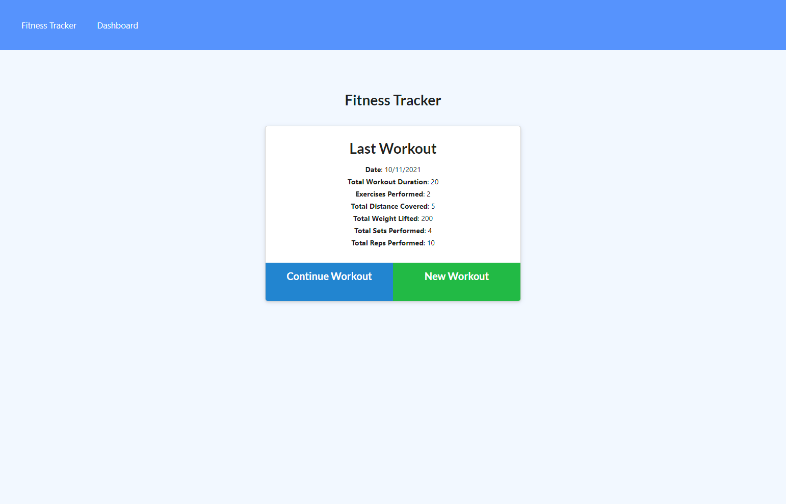

# Workout Tracker

## User Story

* As a user, I want to be able to track my workourts and view my workouts. I want to be able to log multiple exercises in a workout on a given day. I should also be able to track the name, type, weight, sets, reps, and duration of exercise. If the exercise is a cardio exercise, I should be able to track my distance traveled.

## Business Context

A consumer will reach their fitness goals more quickly when they track their workout progress.

## Application Interface

When the user loads the page, they should be given the option to create a new workout or continue with their last workout.

The user should be able to:

  * Add exercises to the most recent workout plan.

  * Add new exercises to a new workout plan.

  * View the combined weight of multiple exercises from the past seven workouts on the `stats` page.

  * View the total duration of each workout from the past seven workouts on the `stats` page.

>## Deployment & Getting Started

npm packages include the following:

* "express": "^4.16.3",
* "express-handlebars": "^5.3.4",
* "mongoose": "^5.3.16",
* "morgan": "^1.9.1"

To deploy an application with a MongoDB database to Heroku, you'll need to set up a MongoDB Atlas account and connect a database from there to your application. Be sure to use the following guides for support:

  * [Set Up MongoDB Atlas](../04-Important/MongoAtlas-Setup.md)

  * [Deploy with Heroku and MongoDB Atlas](../04-Important/MongoAtlas-Deploy.md)

## Submission on BCS

You are required to submit the following:

* The URL to the deployed application

* The URL to the GitHub repository

## Links 

Deployed Application Website: https://stormy-lowlands-24966.herokuapp.com/

Github Repo: https://github.com/syackzan/Fitness-Tracker

## Photo

